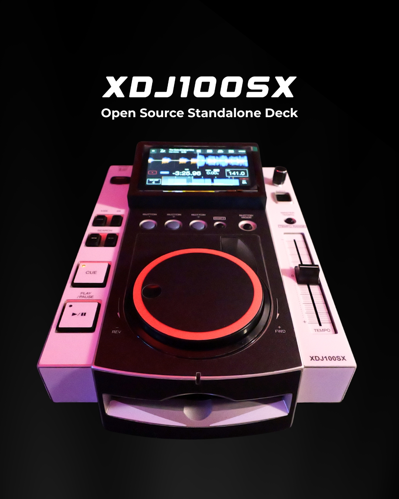

# XDJ100SX
An Open Source Standalone DJ Deck

This project is another experimental project that combines hardware, MIDI and open source software to convert an old Pioneer CDJ-100S to a standalone player using all modern features.

## Main Requirements:

- Raspberri Pi 3b+
- Arduino/Teensy with MIDI libraries

## Content:

- /arduino/ -> firmware code
- /datasheets/ -> Original CDJ, Teensy and Raspberry datasheets
- /images/ -> Process and result pics
- /mixxx/ -> Custom skin and MIDI mapping for this project
- /print-assets/ -> STL file to 3D print + adhesive custom skin to print
- /docs/ -> Documentation of this project

## Raspberri Pi 3B+ Image file

Note it only works with the Raspberry Pi 3B+

[Image File](https://drive.google.com/file/d/1xF3MYwbI78TJTnMUjNkVMXjbA1-jqFb2/view?usp=sharing).

### 📜 License
- All code in this repository is released under the [GNU GPL v3 License](https://www.gnu.org/licenses/gpl-3.0.html).
- All documentation, 3D models, and visual materials are released under the [Creative Commons BY-SA 4.0 License](https://creativecommons.org/licenses/by-sa/4.0/).

© 2025 Marc Monka
