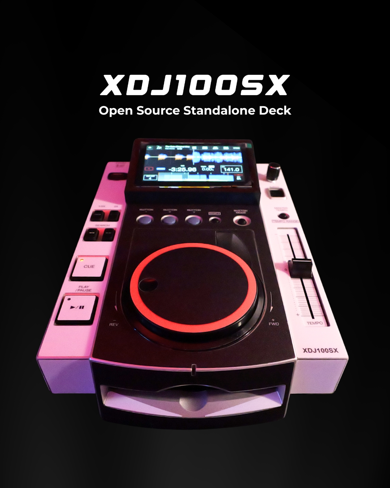

# XDJ100SX
An Open Source Standalone DJ Deck

This project is another experimental project that combines hardware, MIDI and open source software to convert an old Pioneer CDJ-100S to a standalone player using all modern features.

## Main Requirements:

- Raspberri Pi 3b+
- Arduino/Teensy with MIDI libraries

## Content:

- /arduino/ -> firmware code
- /datasheets/ -> Original CDJ, Teensy and Raspberry datasheets
- /images/ -> Process and result pics
- /mixxx/ -> Custom skin and MIDI mapping for this project
- /print-assets/ -> STL file to 3D print + adhesive custom skin to print
- /docs/ -> Documentation of this project

## Raspberry Pi 3B+ Image file

Note it only works with the Raspberry Pi 3B+

[Image File (update June 2026](https://drive.google.com/file/d/12VGHPIK-dUKwpeFkzCrLtSqvwtZfTJgV/view?usp=sharing).

## UPDATES JUNE 2026:

- **Linux packages & Kernel have been updated (June 2026)**
> If you apply the image on a later time, open the terminal and write apt get update && apt get upgrade -y to keep all packages up to date

** USB network share:**
> You can now load music from the other's xdj100sx USB. You only need both devices to be connected to the same network. It work with both WiFi and Ethernet. In Mixxx you will see, under Rekordbox, "USB1" which is the one connected to the second device. The Pi3B+ WiFi is not so fast so you may expect a bit of lag when scrolling network usb drive, but it loads properly.

** USB Eject: **
> I've created a service that is monitoring the "BACK" button. If you hold this button for 3 seconds, the script will unmount/eject the USB so you can unplug it properly. Note that Mixxx still keeps in cache your playlists and tracklist, but you won't be able to load any track once ejected.

** Power off & Mixxx settings: **
> I've changed how power off switch works. Instead of sending a system shutoff, it first closes Mixxx so Mixxx saves all preferences, column layout, etc. Once Mixxx is closed, it power offs the system. IMPORTANT: you must have GPIO Pins 5 and 6 connected to the switch otherwise you will find that Pi will shutdown automatically. The script detects if GPIO Pin 5 and 6 are not shorted, then it starts the shutdown process. If you don't have those pins connected, it won't work.

** User & Password: **
> The device has the same user and password for admin / ssh purposes: xdj100sx

** HOW TO APPLY THE IMAGE: **
> Use Raspberry Pi Imager form a Mac or Windows computer. Choose Raspberry 3b+ and then "Use a custom image". Select the IMG.GZ file.

** HOW TO CONNECT TO WIFI NETWORK:**
> Plug a keyboard to the USB slot. Hold Control+Alt+F2.
> 
> Then type the user xdj100sx and password xdj100sx.
> 
> Then type:
> sudo raspi-config
> 
> You will enter to the Raspi config. Find the Wireless configuration, and add you SSID (Wifi name) and password manually

** HOW TO CONNECT THROUGH SSH: **
> From a computer (Mac/Win/Linux) on the same network, open a command terminal and type:
> 
> ssh xdj100sx@ip
> 
> It will ask for the password which is xdj100sx

** HOW TO KNOW XDJ100SX IP: **
> From the XDJ100SX, connect a keyboard and hold Control + Alt + F2, login with both xdj100sx user and password.
> 
> Then type the following:
> ifconfig
> 
> It will show you all Pi network devices, find the wlan0 or similar and you should see something similar to ip address XXX.XXX.X.XXX (for example 192.168.1.132)

### 📜 License
- All code in this repository is released under the [GNU GPL v3 License](https://www.gnu.org/licenses/gpl-3.0.html).
- All documentation, 3D models, and visual materials are released under the [Creative Commons BY-SA 4.0 License](https://creativecommons.org/licenses/by-sa/4.0/).

2025 Marc Monka
